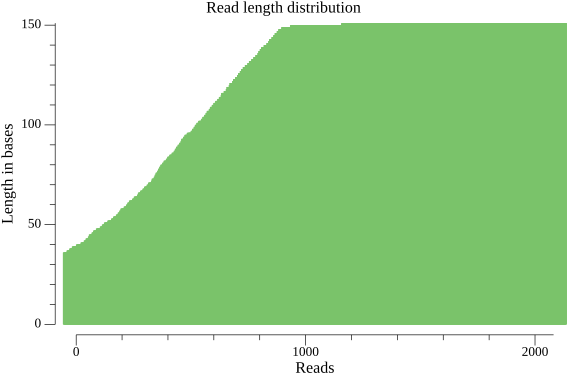

FastXViz
========

Plot read length distribution from FastQ files, in .pdf or .png format.

## Install

Copy the binary corresponding to your operating system from the latest release.

## Example usage

```bash
./fastxviz -in reads.fq -out readlengths.png
```

This will result in a plot like the one below:

## Example plot




## Acknowledgements

Hat tip to the [gonum plot package](https://github.com/gonum/plot) which this
tool relies heavily upon.
